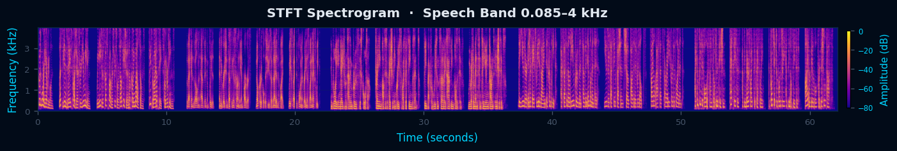
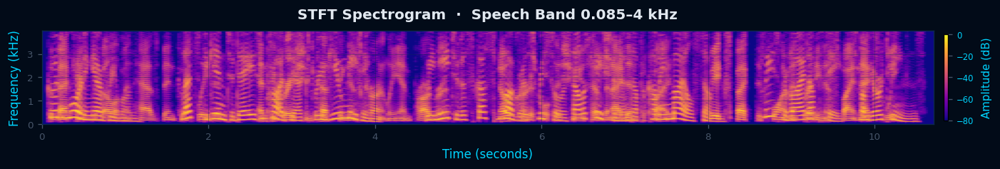
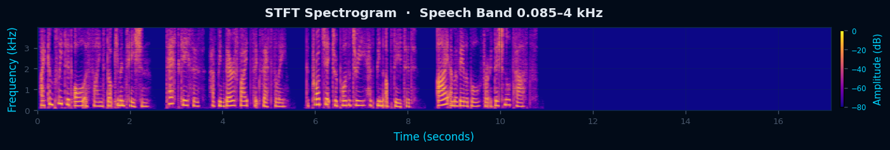
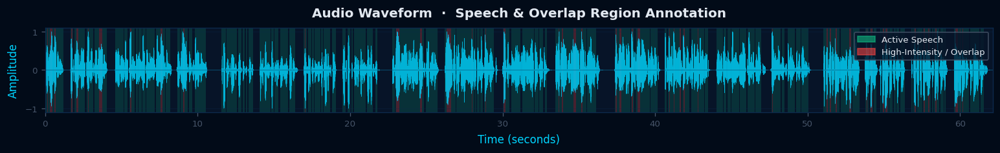
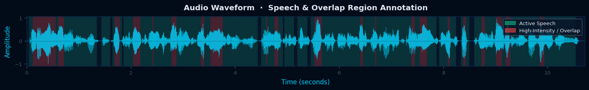
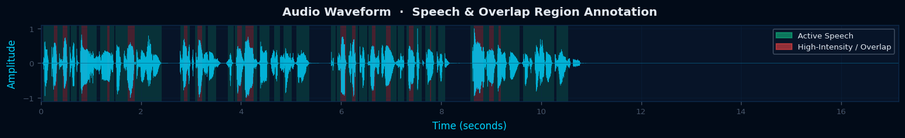

# 🎙️ Meeting Harmony Analyzer

A real-time audio analytics dashboard that measures meeting communication quality using DSP signal processing. Scores meetings on a 0–100 scale based on speech balance, overlap, and silence.

---

## 🚀 Features

- **Pre-recorded analysis** — Analyze any WAV file or pick from 15 bundled samples
- **Live recording** — Microphone capture → WebSocket → real-time metrics every 3s
- **Harmony Score** — Composite 0–100 score; rewards balanced turn-taking, penalises both extremes (too chaotic or too silent)
- **3 DSP charts** — Spectrogram, annotated waveform, RMS energy timeline
- **Live RMS chart** — Rolling Chart.js graph updating every 3s during live mode
- **Warning toasts** — Slide-in alerts for critical / warning / success diagnostics
- **Animated UI** — Background cycles through colour themes every 10 seconds
- **Audio generator** — `generate_meetings.py` to regenerate all test WAVs from speaker profiles

---

## 📁 Project Structure

```
meeting_harmony_analyzer/
├── run.py                    ← Start server (python run.py)
├── generate_meetings.py      ← Regenerate audio/ from speaker profiles
├── requirements.txt
│
├── backend/
│   ├── audio_processor.py    ← Full DSP pipeline + harmony scoring
│   └── main.py               ← FastAPI (REST + WebSocket)
│
├── frontend/
│   └── index.html            ← Single-file dashboard
│
├── docs/
│   └── images/               ← Screenshots for README
│       ├── spec_good.png
│       ├── spec_chaotic.png
│       ├── spec_silent.png
│       ├── speech_good.png
│       ├── speech_chaotic.png
│       └── speech_silent.png
│
└── audio/
    ├── perfect.wav            ← Meeting scenarios (10)
    ├── good.wav
    ├── average.wav
    ├── chaotic.wav
    ├── dead.wav
    ├── dominant.wav
    ├── emergency.wav
    ├── interruptions.wav
    ├── roundtable.wav
    ├── silent.wav
    ├── manager.wav            ← Speaker profiles (5)
    ├── designer.wav
    ├── engineer.wav
    ├── hr.wav
    └── intern.wav
```

---

## ⚙️ Setup

### 1. Install dependencies

```bash
pip install fastapi uvicorn[standard] python-multipart librosa scipy numpy matplotlib soundfile websockets
```

### 2. (Optional) Regenerate audio test cases

```bash
python generate_meetings.py
```

### 3. Run the server

```bash
python run.py
```

### 4. Open the dashboard

```
http://localhost:8000
```

---

## 🔌 API Reference

| Method | Path | Description |
|---|---|---|
| `GET` | `/` | Dashboard HTML |
| `GET` | `/api/health` | Health check |
| `GET` | `/api/samples` | List all sample WAVs |
| `GET` | `/api/sample/{filename}` | Analyze a bundled sample |
| `POST` | `/api/analyze` | Upload + analyze a WAV file |
| `WS` | `/ws/live` | WebSocket for live PCM streaming |
| `GET` | `/docs` | FastAPI Swagger UI |

---

## 📊 Harmony Score

The score rewards meetings that look like real conversations: ~60% active speech, short natural pauses, minimal overlap.

```
balance_score   = gaussian(active%, ideal=62%, spread=22%) × 55
overlap_penalty = max(0, overlap% − 10) / 30 × 40
silence_penalty = 0             if 5% ≤ silence% ≤ 40%
                = ramp penalty  if silence% < 5%  (no breathing room)
                = ramp penalty  if silence% > 40% (dead meeting)

Score = clamp(25 + balance_score − overlap_penalty − silence_penalty, 0, 100)
```

| Score | Grade |
|---|---|
| 75 – 100 | ✅ Excellent |
| 60 – 74 | ℹ️ Good |
| 40 – 59 | ⚠️ Poor |
| 0 – 39 | 🚨 Critical |

### Expected scores for bundled samples

| File | Score | Grade |
|---|---|---|
| good.wav | ~79 | ✅ Excellent |
| perfect.wav | ~75 | ✅ Excellent |
| dominant.wav | ~73 | ✅ Good |
| roundtable.wav | ~73 | ✅ Good |
| average.wav | ~60 | ℹ️ Good |
| chaotic.wav | ~42 | ⚠️ Poor |
| dead.wav | ~28 | 🚨 Critical |
| interruptions.wav | ~25 | 🚨 Critical |
| emergency.wav | ~22 | 🚨 Critical |
| silent.wav | ~17 | 🚨 Critical |

> **Note:** Scores use amplitude-threshold overlap detection (no speaker diarisation). A mono mix where two voices overlap at moderate volume registers lower overlap than expected — inherent limitation of single-channel audio.

---

## 📸 Visual Samples

Three representative test cases showing the full range from healthy to broken communication.

### Spectrograms

| Good Meeting (79) | Chaotic Meeting (42) | Silent Meeting (17) |
|:---:|:---:|:---:|
|  |  |  |
| Clean alternating speech bands | Dense overlapping energy | Mostly blank — one short burst |

### Speech Activity

| Good Meeting (79) | Chaotic Meeting (42) | Silent Meeting (17) |
|:---:|:---:|:---:|
|  |  |  |
| Balanced turns, healthy pauses | Constant overlap, no pauses | Near-zero activity throughout |

---

## 🧠 DSP Pipeline

```
WAV Input
  └→ Librosa load (22 050 Hz mono)
      └→ Butterworth bandpass filter (85–4000 Hz, 4th order)
          └→ Frame-level RMS (frame=2048, hop=512)
              └→ Frame classification (silence / speech / overlap)
                  └→ STFT spectrogram (speech band)
                      └→ Harmony Score + warnings
                          └→ Matplotlib charts → base64 PNG

WebSocket (live)
  └→ Float32 PCM @ 16 kHz received in chunks
      └→ Sliding window (3 s analysis, 1.5 s advance)
          └→ Same DSP pipeline above → JSON metrics
```

---

## 🖥️ Tech Stack

| Layer | Technology |
|---|---|
| Backend | Python 3.11+, FastAPI, Uvicorn |
| DSP | Librosa, NumPy, SciPy |
| Visualisation | Matplotlib (server), Chart.js (client) |
| Live audio | WebSocket + AudioWorklet (PCM Float32 @ 16 kHz) |
| Frontend | Vanilla HTML / CSS / JS — no build step |
